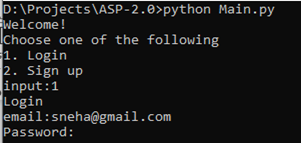
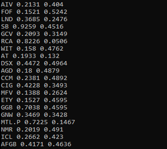
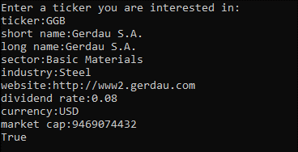
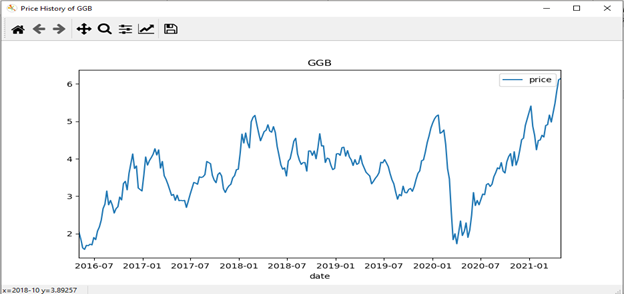
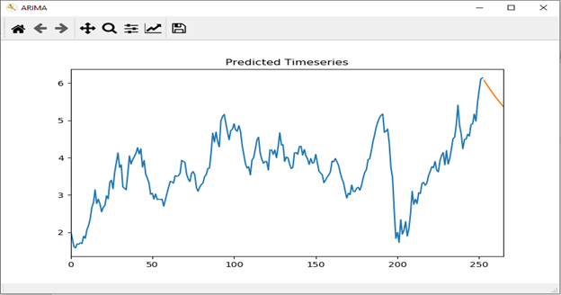

##	Step 1:
Create NYSE database using DDL script, nysq_db.sql
##	Step 2:
Using yfinance (Yahoo Finance python API) download the price series and calculate Return Rate and Volatility.

-	Tickers are sourced from NYSE.csv file
-	Change start, end date, and file name i.e., line 16,17 and 31) in the code for making it up to date.
 
Import the created csv into price_data table
##	Step 3:
Import the E:\Price_Data\price_data_2021-05-05.csv into spark and run the pySpark program from Pyspark_Calculations.md
-	Download the csv files from spark cluster 
    -	security_master
    -	weekly_data
-	Import the security_master csv file into security_master table
-	Import the weekly_data csv file into weekly_data table

## Step 4:

Sign up and create a user profile that helps determine the risk appetite and expected return for the user.

 

## Step 5:
Based on Risk Appetite and Expected Return of user suggest the stocks to user. 

## Step 6:
Ask User to pick a ticker and project the time series of the ticker.

 
Based on the price history of the ticker, project the future price series using ARIMA model (Autoregressive Integrated Moving Average) 

